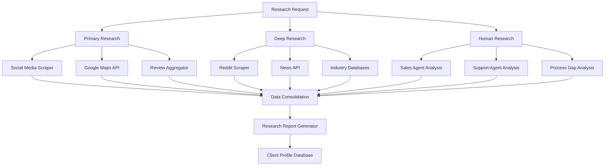
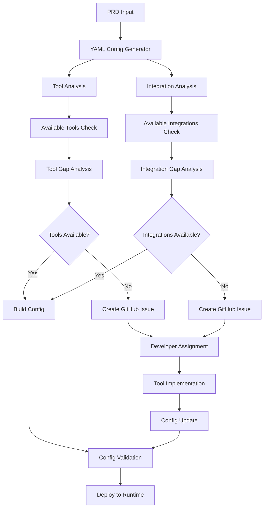
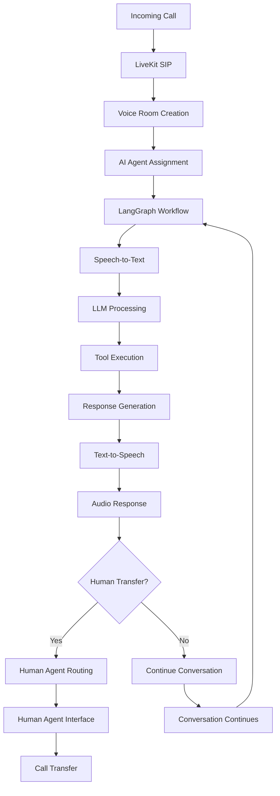

# Technical Architecture Document: Complete Workflow Automation System

## Executive Summary

This document outlines the technical architecture for a comprehensive workflow automation system designed to automate customer sales and support operations through AI-powered chatbots and voicebots. The system leverages cutting-edge AI frameworks, microservices architecture, and enterprise-grade security patterns to deliver a scalable, multi-tenant platform capable of 95% automation within 12 months.

## System Overview

The workflow automation system consists of 12 core engines working in concert to deliver end-to-end automation for client sales and support operations. The architecture follows a microservices pattern with each engine implemented as an independent service, enabling scalability, maintainability, and independent deployment.

### Core Engines

1. **Research Engine** - Multi-source data collection and analysis
2. **Demo Generator Engine** - Web UI demo creation with mock data
3. **NDA Generator** - Automated NDA generation and management
4. **Pricing Model Generator** - Dynamic pricing based on use cases
5. **Proposal & Agreement Draft Generator** - Web-based proposal editing
6. **PRD Builder Engine** - Interactive product requirements document creation
7. **Automation Engine** - YAML configuration generation and management
8. **Chatbot Runtime Service** - LangGraph-based conversation management
9. **Voicebot Runtime Service** - LiveKit-based voice interaction
10. **Monitoring Engine** - Proactive system monitoring and incident management
11. **Customer Support Engine** - AI-powered internal support automation
12. **Customer Success Engine** - KPI tracking and insight generation

## Technology Stack

### Core AI Frameworks
- **LangGraph**: Primary orchestration framework for stateful, multi-agent workflows
- **LangChain**: Supporting framework for LLM abstractions and tool integration
- **OpenAI GPT-4/GPT-4-turbo**: Primary language models with fallback to open-source alternatives

### Voice Infrastructure
- **LiveKit Server**: WebRTC media server for real-time voice/video
- **LiveKit SIP**: Telephony integration for inbound/outbound calls
- **Twilio**: Alternative telephony provider for redundancy

### Data Storage
- **Supabase** (PostgreSQL): Primary structured data storage with built-in RLS
- **Pinecone**: Vector database for RAG/GraphRAG implementations
- **Redis**: Caching and session management

### Integration & APIs
- **Model Context Protocol (MCP)**: Standardized tool and data source integration
- **REST APIs**: Primary service communication pattern
- **gRPC**: High-performance inter-service communication
- **WebSockets**: Real-time communication for web interfaces

### Infrastructure & DevOps
- **Docker**: Containerization
- **Kubernetes**: Container orchestration
- **Istio**: Service mesh for security and traffic management
- **Prometheus + Grafana**: Monitoring and visualization
- **Jaeger**: Distributed tracing

## Microservices Architecture

### API Gateway Layer
```
┌─────────────────────────────────────────────────────────────┐
│                    API Gateway                              │
│  - Authentication & Authorization                           │
│  - Rate Limiting & Throttling                               │
│  - Request Routing & Load Balancing                         │
│  - API Versioning                                           │
│  - Cross-Origin Resource Sharing (CORS)                     │
└─────────────────────────────────────────────────────────────┘
```

### Core Services Architecture

#### 1. Research Engine Microservice
```yaml
Technology: Python + FastAPI
Data Sources:
  - Social Media Scrapers (Instagram, Facebook, TikTok)
  - Google Maps API Integration
  - Review Platforms (Google Reviews, Yelp)
  - Custom Data Aggregation Service
Database: Supabase + Pinecone for insights storage
Processing: Async task processing with Celery
```

#### 2. Chatbot Runtime Service
```yaml
Technology: Python + LangGraph
Architecture: Two-node LangGraph workflow
  - Agent Node: LLM reasoning and decision making
  - Tools Node: Tool execution and API calls
Integration: MCP for tool connections
State Management: Persistent state in Redis
Scalability: Horizontal scaling with load balancing
```

#### 3. Voicebot Runtime Service
```yaml
Technology: Go + LiveKit + Python integration
Components:
  - LiveKit Server: WebRTC media handling
  - LiveKit SIP: Telephony integration
  - AI Agent Core: LangGraph-based decision engine
Features:
  - Real-time voice processing
  - Call routing and transfer
  - Voicemail and callback handling
  - Multi-language support
```

#### 4. Monitoring Engine
```yaml
Technology: Go + Prometheus + Python
Components:
  - Health Check Service: System monitoring
  - Anomaly Detection: AI-powered issue identification
  - Incident Management: Automated alerting and escalation
  - SLA Tracking: Performance metrics and compliance
Integration: PagerDuty for critical alerts
```

### Data Flow Architecture

#### YAML Configuration System
The system uses a centralized YAML configuration approach for dynamic behavior management:

```yaml
Config Structure:
  client_id: string
  use_case_id: string
  system_prompt: string
  tools:
    - name: string
      input_schema: object
      output_schema: object
      endpoint: string
  integrations:
    - type: string
      config: object
  kpi_definitions: object
  escalation_rules: object
```

#### Multi-tenant Data Isolation
```yaml
Strategy: Schema-based separation
Implementation:
  - Separate Supabase schemas per client
  - Row-Level Security (RLS) for fine-grained access
  - Client-specific Pinecone indexes
  - Isolated Redis namespaces
Security: OAuth2 + JWT tokens with client scoping
```

## Detailed Service Architecture

### Research Engine Deep Dive



### Automation Engine Architecture



### Voicebot Runtime Architecture



## Security Architecture

### Authentication & Authorization
```yaml
Authentication: OAuth2 + OpenID Connect
Providers: Auth0 or AWS Cognito
Token Management: JWT with refresh tokens
Authorization: RBAC with client-based scoping
Session Management: Redis-based session store
```

### Data Security
```yaml
Encryption:
  - At Rest: AES-256 (Supabase/PostgreSQL)
  - In Transit: TLS 1.3
  - PII: Field-level encryption
PII Handling:
  - Identification and classification
  - Separate storage with enhanced security
  - Compliance with GDPR/CCPA
Audit Logging: Comprehensive activity tracking
```

### Network Security
```yaml
Service Mesh: Istio with mTLS
Network Policies: Kubernetes NetworkPolicies
API Security: Rate limiting, input validation
VPC Isolation: Private network for inter-service communication
```

## Scalability Architecture

### Horizontal Scaling Strategy
```yaml
Stateless Services: Auto-scaling based on CPU/memory
Stateful Services: Custom scaling with state replication
Database:
  - Read replicas for read-heavy workloads
  - Connection pooling
  - Query optimization
Caching: Multi-layer caching strategy
CDN: Static content delivery
```

### Performance Optimization
```yaml
Async Processing: Celery for background tasks
Connection Pooling: Database and external API connections
Caching Layers:
  - Application-level caching
  - Database query caching
  - API response caching
Load Balancing: Application and database load balancing
```

## Monitoring & Observability

### Monitoring Stack
```yaml
Metrics: Prometheus collection
Visualization: Grafana dashboards
Logging: ELK Stack (Elasticsearch, Logstash, Kibana)
Tracing: Jaeger for distributed tracing
Alerting: PagerDuty integration for critical issues
```

### KPI Tracking
```yaml
Business KPIs:
  - Automation percentage
  - Response time improvements
  - Customer satisfaction scores
  - Cost savings metrics
Technical KPIs:
  - System uptime
  - Response times
  - Error rates
  - Resource utilization
```

## Deployment Architecture

### Container Strategy
```yaml
Base Images: Minimal Alpine-based images
Multi-stage Builds: Optimize image sizes
Security Scanning: Trivy for vulnerability scanning
Registry: Harbor or AWS ECR
Image Signing: Notation for image verification
```

### Kubernetes Deployment
```yaml
Cluster Management:
  - Multiple availability zones
  - Auto-scaling groups
  - Rolling deployments
Resource Management:
  - Resource requests and limits
  - Quality of Service classes
  - Pod priority and preemption
Storage: Persistent volumes for stateful services
```

## Implementation Roadmap

### Phase 1: Foundation (Months 1-3)
```yaml
Core Infrastructure:
  - Kubernetes cluster setup
  - CI/CD pipeline implementation
  - Monitoring stack deployment
  - Security framework implementation

Core Services:
  - Chatbot Runtime Service (LangGraph)
  - Voicebot Runtime Service (LiveKit)
  - YAML Configuration System
  - Basic Monitoring Engine

MVP Features:
  - Single client support
  - Basic chat/voice automation
  - Simple configuration management
```

### Phase 2: Expansion (Months 4-6)
```yaml
Additional Engines:
  - Research Engine implementation
  - Demo Generator Engine
  - NDA Generator
  - Pricing Model Generator

Advanced Features:
  - Multi-tenant support
  - Advanced YAML configurations
  - Tool integration framework
  - Enhanced monitoring
```

### Phase 3: Enterprise Features (Months 7-9)
```yaml
Business Engines:
  - PRD Builder Engine
  - Proposal & Agreement Generator
  - Customer Support Engine
  - Customer Success Engine

Advanced Capabilities:
  - A/B testing framework
  - Advanced analytics
  - Custom integrations
  - Enterprise security features
```

### Phase 4: Optimization (Months 10-12)
```yaml
Optimization:
  - Performance tuning
  - Cost optimization
  - Advanced automation features
  - AI model fine-tuning

Scale Preparation:
  - Multi-region deployment
  - Advanced monitoring
  - Disaster recovery
  - Compliance certifications
```

## Technology Rationale

### LangGraph vs LangChain Choice
**LangGraph Selected For:**
- Stateful workflow management
- Complex branching logic support
- Human-in-the-loop capabilities
- Durable execution with streaming
- Better suited for complex business processes

### LiveKit Voice Infrastructure
**LiveKit Selected For:**
- Open-source and self-hostable
- Proven scalability (ChatGPT Advanced Voice)
- Comprehensive SIP integration
- Real-time media processing
- Active community and enterprise support

### Microservices Architecture
**Selected For:**
- Independent scaling and deployment
- Technology heterogeneity
- Fault isolation
- Team autonomy
- Easier maintenance and evolution

## Risk Mitigation

### Technical Risks
```yaml
LLM Reliability:
  - Multiple model providers
  - Fallback mechanisms
  - Quality monitoring

Integration Complexity:
  - Standardized MCP protocol
  - Comprehensive testing
  - Version management

Scaling Challenges:
  - Incremental scaling approach
  - Performance monitoring
  - Capacity planning
```

### Business Risks
```yaml
Vendor Lock-in:
  - Open-source preference
  - Standard interfaces
  - Migration strategies

Security Compliance:
  - Regular security audits
  - Compliance automation
  - Documentation maintenance

Talent Requirements:
  - Comprehensive documentation
  - Knowledge sharing
  - Training programs
```

## Conclusion

This technical architecture provides a comprehensive foundation for building an enterprise-grade workflow automation system. The microservices approach, combined with modern AI frameworks and robust infrastructure, enables the system to scale while maintaining security and reliability.

The architecture supports the business goal of achieving 95% automation within 12 months while providing the flexibility to adapt to diverse client requirements. The phased implementation approach allows for iterative development and continuous improvement based on real-world usage and feedback.

The combination of LangGraph for AI orchestration, LiveKit for voice infrastructure, and a well-designed microservices architecture creates a powerful platform capable of transforming customer sales and support operations through intelligent automation.