# AI-Powered Workflow Automation Platform - Modular Workflow Diagrams

This document breaks down the complete platform workflow into digestible, renderable diagrams organized by phase and concern.

**Architecture:** 16 microservices (15 core + 2 libraries) coordinated via 17 Kafka topics
**Performance:** 400-900ms faster workflows through service consolidation and direct library integration

---

## Table of Contents

1. [High-Level System Overview](#1-high-level-system-overview)
2. [Phase 0: Organization Setup & Agent Assignment](#2-phase-0-organization-setup--agent-assignment)
3. [Phase 1: Research & Requirements](#3-phase-1-research--requirements)
4. [Phase 2-3: Demo, Legal & Contracting](#4-phase-2-3-demo-legal--contracting)
5. [Phase 4: Implementation & Deployment](#5-phase-4-implementation--deployment)
6. [Phase 5: Runtime Operations (Chatbot)](#6-phase-5-runtime-operations-chatbot)
7. [Phase 5: Runtime Operations (Voicebot)](#7-phase-5-runtime-operations-voicebot)
8. [Phase 5: Support & Success Workflows](#8-phase-5-support--success-workflows)
9. [Phase 5: Client Self-Service & Personalization](#9-phase-5-client-self-service--personalization)
10. [Phase 6: Iteration & Expansion](#10-phase-6-iteration--expansion)
11. [Human Agent Handoff Workflows](#11-human-agent-handoff-workflows)
12. [Event Flow Architecture](#12-event-flow-architecture)
13. [Service Dependencies](#13-service-dependencies)

---

## 1. High-Level System Overview

**Automation Progression:**
- Week 1: 60% automated
- Month 3: 80% automated
- Month 6: 90% automated
- Month 12: 95%+ automated

---

## 2. Phase 0: Organization Setup & Agent Assignment

```mermaid
flowchart TB
    subgraph Paths["Two Signup Paths"]
        SelfService["👤 Self-Service Signup<br/>(Work Email)"]
        Assisted["🤝 Assisted Signup<br/>(Sales Agent Creates Account)"]
    end

    subgraph Service0["Service 0: Organization & Identity Management<br/>(Unified - includes agent orchestration)"]
        Verify["Email Verification"]
        CreateOrg["Create Organization"]
        Invite["Send Team Invitations"]
        AutoAssign["Auto-Assign to<br/>Sales Agent<br/>(Workload-Balanced)"]
        ClaimLink["Send Claim Link<br/>(via Service 20)"]
        ClientClaims["Client Claims<br/>Account Ownership"]
    end

    ResearchStart["✅ Trigger Research Engine<br/>(Service 1)"]

    %% Self-service path
    SelfService --> Verify
    Verify --> CreateOrg
    CreateOrg --> Invite
    CreateOrg --> AutoAssign
    AutoAssign -->|organization_created| ResearchStart

    %% Assisted path
    Assisted --> CreateOrg
    CreateOrg -->|assisted_account_created| AutoAssign
    AutoAssign --> ClaimLink
    ClaimLink --> ClientClaims
    ClientClaims -->|assisted_account_claimed| ResearchStart

    style SelfService fill:#e1f5e1
    style Assisted fill:#fff3e0
    style ResearchStart fill:#f3e5f5
```

---

## 3. Phase 1: Research & Requirements

```mermaid
flowchart TB
    Trigger["organization_created /<br/>assisted_account_claimed"]

    subgraph Service1["Service 1: Research Engine"]
        Collect["🤖 AUTO: Multi-Source Collection<br/>• LinkedIn (company profile)<br/>• Crunchbase (funding)<br/>• Website scraping<br/>• Competitor analysis"]
        Analyze["🤖 AUTO: AI Analysis<br/>• Volume predictions<br/>• Use case identification<br/>• Integration requirements"]
        Complete["research_completed"]
    end

    subgraph Service20["Service 20: Communication & Hyperpersonalization"]
        Draft["🤖 AUTO: Generate<br/>Requirements Draft<br/>• Predicted volumes<br/>• Suggested use cases"]
        HumanReview["👤 HUMAN: Sales Agent<br/>Reviews & Approves"]
        SendForm["🤖 AUTO: Send<br/>Requirements Form<br/>(Email/SMS Delivery)"]
        ClientValidate["👤 CLIENT: Validates<br/>& Corrects Data"]
        Validated["requirements_validation_completed"]
    end

    DemoTrigger["✅ Trigger Demo Generator<br/>(Service 2)"]

    Trigger --> Collect
    Collect --> Analyze
    Analyze --> Complete
    Complete -->|research_completed| Draft
    Draft --> HumanReview
    HumanReview -->|requirements_draft_approved| SendForm
    SendForm --> ClientValidate
    ClientValidate --> Validated
    Validated --> DemoTrigger

    style Collect fill:#e1f5e1
    style Analyze fill:#e1f5e1
    style Draft fill:#e1f5e1
    style HumanReview fill:#fff3e0
    style ClientValidate fill:#fff3e0
    style DemoTrigger fill:#f3e5f5
```

---

## 4. Phase 2-3: Demo, Legal & Contracting

```mermaid
flowchart TB
    Start["requirements_validation_completed"]

    subgraph Phase2["Phase 2: Demo & Proof of Concept"]
        subgraph Service2["Service 2: Demo Generator"]
            Design["🤖 AUTO: Demo Design<br/>• LangGraph config<br/>• LiveKit voice setup<br/>• Mock data generation"]
            Generate["🤖 AUTO: Generate Demo<br/>• Chatbot (LangGraph)<br/>• Voicebot (LiveKit)"]
        end

        Meeting["👤 HUMAN: Sales Meeting<br/>Demo Presentation & Q&A"]
        Approved["demo_approved + pilot_agreed"]
    end

    subgraph Phase3["Phase 3: Legal & Contracting"]
        subgraph Service3["Service 3: Sales Document Generator<br/>(Unified - 150-300ms faster)"]
            NDA["🤖 AUTO: Generate NDA"]
            SignNDA["🤖 AUTO: E-Signature<br/>(DocuSign)"]
            NDADone["sales_doc_events.nda_signed"]
        end

        subgraph Service6["Service 6: PRD Builder & Configuration Workspace"]
            PRDConv["🤖 AUTO: Conversational<br/>PRD Builder<br/>• Village knowledge<br/>• A/B flows<br/>• KPI framework<br/>• 12-month roadmap"]
            HelpBtn["👤 HUMAN: Help Button<br/>Real-time Collaboration"]
            PRDApp["prd_approved"]
        end

        subgraph Service3b["Service 3: Sales Document Generator (continued)"]
            Price["🤖 AUTO: Volume-Based<br/>Pricing & Cost Modeling"]
            Proposal["🤖 AUTO: Generate Proposal<br/>Research + Demo + PRD + Pricing"]
            SignProp["🤖 AUTO: E-Signature"]
            PropDone["sales_doc_events.proposal_signed"]
        end
    end

    AutoEngine["✅ Trigger Automation Engine<br/>(Service 7)<br/>(400-900ms faster workflow)"]

    Start --> Design
    Design --> Generate
    Generate --> Meeting
    Meeting --> Approved
    Approved --> NDA
    NDA --> SignNDA
    SignNDA --> NDADone
    NDADone --> PRDConv
    PRDConv -.->|help_requested| HelpBtn
    HelpBtn -.-> PRDConv
    PRDConv --> PRDApp
    PRDApp --> Price
    Price --> Proposal
    Proposal --> SignProp
    SignProp --> PropDone
    PropDone --> AutoEngine

    style Design fill:#e1f5e1
    style Generate fill:#e1f5e1
    style Meeting fill:#fff3e0
    style HelpBtn fill:#fff3e0
    style AutoEngine fill:#f3e5f5
```

---

## 5. Phase 4: Implementation & Deployment

```mermaid
flowchart TB
    Start["proposal_signed"]

    subgraph Handoff1["Human Agent Handoff (Service 0)"]
        SalesTo["handoff_initiated<br/>Sales → Onboarding"]
        OnboardAccept["Onboarding Specialist<br/>handoff_accepted"]
    end

    subgraph Service7["Service 7: Automation Engine"]
        Convert["🤖 AUTO: PRD → YAML<br/>• System prompts<br/>• Tool configs<br/>• Voice parameters"]
        GitHub["🤖 AUTO: Create GitHub Issues<br/>for Missing Tools"]
        Wait["⏳ Platform Engineers<br/>Develop Tools"]
        ConfigGen["config_generated"]
    end

    subgraph ConfigSDK["@workflow/config-sdk Library<br/>(50-100ms faster than service)"]
        Validate["🤖 AUTO: Validate Config<br/>• JSON schema<br/>• S3 upload (versioned)<br/>• Redis cache invalidation"]
        Deploy["config_deployed"]
    end

    subgraph Runtime["Runtime Services (use @workflow/llm-sdk)"]
        Service8["Service 8:<br/>Agent Orchestration<br/>(Chatbot)<br/>(200-500ms faster LLM calls)"]
        Service9["Service 9:<br/>Voice Agent<br/>(Voicebot)<br/>(200-500ms faster LLM calls)"]
        Ready["services_ready"]
    end

    Week1["👤 HUMAN: Week 1 Handholding<br/>Onboarding Specialist<br/>Daily Monitoring & Tuning"]
    Complete["onboarding_week1_complete"]

    subgraph Handoff2["Parallel Handoff (Service 0)"]
        ToSupport["→ Support Specialist"]
        ToSuccess["→ Success Manager"]
    end

    Operations["✅ Enter Operations Phase<br/>(Total speedup: 400-900ms)"]

    Start --> SalesTo
    SalesTo --> OnboardAccept
    OnboardAccept --> Convert
    Convert --> GitHub
    GitHub --> Wait
    Wait -->|github_issue_closed| ConfigGen
    ConfigGen --> Validate
    Validate --> Deploy
    Deploy --> Service8
    Deploy --> Service9
    Service8 --> Ready
    Service9 --> Ready
    Ready --> Week1
    Week1 --> Complete
    Complete --> ToSupport
    Complete --> ToSuccess
    ToSupport --> Operations
    ToSuccess --> Operations

    style Convert fill:#e1f5e1
    style Validate fill:#e1f5e1
    style Week1 fill:#fff3e0
```

---

## 6. Phase 5: Runtime Operations (Chatbot)

```mermaid
flowchart TB
    User["User Message"]

    subgraph Personalization["Service 20: Communication & Hyperpersonalization"]
        Cohort["Assign Cohort<br/>trial / active / power_user<br/>at_risk / churned"]
        Variant["Assign A/B Variant<br/>(Thompson Sampling)"]
    end

    subgraph Service8["Service 8: Agent Orchestration (LangGraph)"]
        Agent["Agent Node<br/>• Stateful conversation<br/>• Tool selection<br/>• Escalation logic"]
        Tools["Tools Node<br/>• CRM Integration<br/>• Support Engine<br/>• Custom tools"]
    end

    subgraph LLMSDK["@workflow/llm-sdk Library<br/>(200-500ms faster - no gateway hop)"]
        Route["Model Routing<br/>GPT-4 vs GPT-3.5"]
        Cache["Semantic Caching<br/>(40-60% cost reduction)"]
    end

    subgraph Service17["Service 17: RAG Pipeline"]
        Vector["Vector Search<br/>(Qdrant)"]
        Graph["Graph Reasoning<br/>(Neo4j)"]
        Knowledge["Village Knowledge<br/>Retrieval"]
    end

    Response["Chatbot Response<br/>(200-500ms faster)"]

    subgraph Analytics["Service 12: Analytics"]
        Track["Track Engagement"]
        UpdateWeights["Update A/B Weights<br/>Success: α+1<br/>Failure: β+1"]
    end

    Monitor["Service 11: Monitoring<br/>Quality Checks & Alerts"]

    User --> Cohort
    Cohort --> Variant
    Variant --> Agent
    Agent --> Route
    Route --> Cache
    Cache -.->|if knowledge needed| Vector
    Vector --> Graph
    Graph --> Knowledge
    Knowledge --> Cache
    Cache --> Agent
    Agent --> Tools
    Tools --> Agent
    Agent --> Response
    Response --> Track
    Track --> UpdateWeights
    UpdateWeights --> Variant
    Response --> Monitor

    style Agent fill:#e3f2fd
    style Route fill:#e1f5e1
    style Cache fill:#e1f5e1
```

---

## 7. Phase 5: Runtime Operations (Voicebot)

---

## 8. Phase 5: Support & Success Workflows

```mermaid
flowchart TB
    subgraph SupportTrack["Support Track (90% Automation)"]
        Ticket["ticket_created"]
        AISupport["🤖 AUTO: AI Support Engine<br/>• Knowledge base lookup<br/>• Automated resolution<br/>• Config tuning suggestions"]
        Complex["Complex Issue?"]
        HumanEsc["👤 HUMAN: Support Specialist<br/>Escalation Handling"]
        Resolved["ticket_resolved"]
        Supervision["🤖 AUTO: AI Supervision<br/>Pattern Analysis"]
        ConfigUpdate["config_updated<br/>→ Hot-Reload"]
    end

    subgraph SuccessTrack["Success Track"]
        DailyKPI["🤖 AUTO: Daily KPI Monitoring<br/>• Usage analytics<br/>• Health scoring<br/>• Churn prediction"]
        MonthlyQBR["👤 HUMAN: Success Manager<br/>Monthly QBR Review"]
        Upsell["opportunity_identified"]

        subgraph UpsellFlow["Upsell Workflow"]
            InviteSpec["Success Manager<br/>Invites Sales Specialist"]
            Pitch["Sales Specialist<br/>Expansion Pitch"]
            Close["upsell_closed"]
            HandoffBack["specialist_handoff_back<br/>→ Success Manager"]
        end
    end

    Ticket --> AISupport
    AISupport --> Complex
    Complex -->|Yes - 10%| HumanEsc
    Complex -->|No - 90%| Resolved
    HumanEsc --> Resolved
    Resolved --> Supervision
    Supervision --> ConfigUpdate

    DailyKPI --> MonthlyQBR
    MonthlyQBR --> Upsell
    Upsell --> InviteSpec
    InviteSpec --> Pitch
    Pitch --> Close
    Close --> HandoffBack
    HandoffBack --> MonthlyQBR

    style AISupport fill:#e1f5e1
    style HumanEsc fill:#fff3e0
    style MonthlyQBR fill:#fff3e0
```

---

## 9. Phase 5: Client Self-Service & Personalization

```mermaid
flowchart TB
    subgraph SelfService["Service 6: PRD Builder & Configuration Workspace<br/>(Unified - includes client self-service)"]
        ChatAgent["🤖 Conversational Agent<br/>(Claude AI)<br/>Natural language editing"]
        Dashboard["📊 Visual Dashboard<br/>• Version control<br/>• Sandbox testing<br/>• Rollback"]
        Permissions["Member Permissions<br/>• Role-based access<br/>• Risk levels<br/>• Approval workflows"]
    end

    Change["client_config_change_requested"]
    Validate["🤖 AUTO: Validate & Assess Risk"]
    Preview["config_preview_generated<br/>Sandbox Environment"]
    Approve["Client Approves"]
    Apply["client_config_applied"]

    subgraph ConfigSDK["@workflow/config-sdk Library<br/>(50-100ms faster than service)"]
        HotReload["🔄 Hot-Reload<br/><1s deployment<br/>(50-100ms improvement)"]
        Runtime["Agent Orchestration +<br/>Voice Agent"]
    end

    subgraph Personalization["Service 20: Communication & Hyperpersonalization<br/>(Unified outreach + personalization)"]
        CohortEngine["Cohort Assignment Engine<br/>RFM Analysis"]
        ABEngine["A/B Testing Engine<br/>Thompson Sampling<br/>Multi-Armed Bandit"]
        EngageTrack["Engagement Tracking"]
        WeightUpdate["Variant Weight Updates<br/>Beta(α, β) distribution"]
    end

    ChatAgent --> Change
    Dashboard --> Change
    Change --> Validate
    Validate --> Preview
    Preview --> Approve
    Approve --> Apply
    Apply --> HotReload
    HotReload --> Runtime

    CohortEngine --> ABEngine
    ABEngine --> Runtime
    Runtime --> EngageTrack
    EngageTrack --> WeightUpdate
    WeightUpdate --> ABEngine

    style ChatAgent fill:#e3f2fd
    style HotReload fill:#e1f5e1
    style ABEngine fill:#e1f5e1
```

---

## 10. Phase 6: Iteration & Expansion

```mermaid
flowchart TB
    Identify["👤 HUMAN: Success Manager<br/>Identifies Iteration Need<br/>• New use cases<br/>• Feature expansion<br/>• Integration additions"]

    subgraph Service0["Service 0: Organization & Identity Management<br/>(Handles all agent handoffs)"]
        InviteOnboard["specialist_invited<br/>Success → Onboarding Specialist"]
        Accept["Specialist Accepts"]
    end

    subgraph Service6["Service 6: PRD Builder & Configuration Workspace"]
        UpdatePRD["👤 HUMAN + 🤖 AI:<br/>Update PRD<br/>Collaborative Editing"]
        Approve["prd_updated"]
    end

    subgraph Service7["Service 7: Automation Engine"]
        Regen["🤖 AUTO: Regenerate Config<br/>Incremental Changes"]
    end

    Deploy["config_deployed<br/>Hot-Reload via @workflow/config-sdk<br/>(50-100ms faster)"]

    Exit["specialist_handoff_back<br/>→ Success Manager<br/>(via Service 0)"]
    Continue["Continue Success Track"]

    Identify --> InviteOnboard
    InviteOnboard --> Accept
    Accept --> UpdatePRD
    UpdatePRD --> Approve
    Approve --> Regen
    Regen --> Deploy
    Deploy --> Exit
    Exit --> Continue

    style UpdatePRD fill:#e3f2fd
    style Regen fill:#e1f5e1
```

---

## 11. Human Agent Handoff Workflows

```mermaid
flowchart TB
    subgraph Lifecycle["Client Lifecycle with Human Agents"]
        Start["Organization Created"]

        subgraph Sales["Sales Stage (40% Human)"]
            SalesAgent["Sales Agent<br/>• Research review<br/>• Demo presentation<br/>• Negotiation"]
        end

        subgraph Onboarding["Onboarding Stage (40% Human)"]
            OnboardSpec["Onboarding Specialist<br/>• PRD collaboration<br/>• Config review<br/>• Week 1 monitoring"]
        end

        subgraph Operations["Operations Stage (10% Human)"]
            SupportSpec["Support Specialist<br/>• Complex escalations<br/>• Config tuning<br/>• Quality supervision"]

            SuccessMgr["Success Manager<br/>• Monthly QBRs<br/>• Expansion identification<br/>• Strategic planning"]
        end

        subgraph Specialists["Dynamic Specialists"]
            SalesSpec["Sales Specialist<br/>(Upsell/Expansion)"]
            OnboardSpec2["Onboarding Specialist<br/>(Iteration Projects)"]
        end
    end

    subgraph Handoffs["Handoff Triggers"]
        H1["proposal_signed<br/>Sales → Onboarding"]
        H2["onboarding_week1_complete<br/>Onboarding → Support + Success<br/>(Parallel)"]
        H3["opportunity_identified<br/>Success → Sales Specialist"]
        H4["iteration_requested<br/>Success → Onboarding Specialist"]
        H5["upsell_closed /<br/>iteration_complete<br/>Specialist → Success Manager"]
    end

    Start --> SalesAgent
    SalesAgent -->|H1| OnboardSpec
    OnboardSpec -->|H2| SupportSpec
    OnboardSpec -->|H2| SuccessMgr
    SuccessMgr -->|H3| SalesSpec
    SuccessMgr -->|H4| OnboardSpec2
    SalesSpec -->|H5| SuccessMgr
    OnboardSpec2 -->|H5| SuccessMgr

    style SalesAgent fill:#fff3e0
    style OnboardSpec fill:#fff3e0
    style SuccessMgr fill:#fff3e0
```

---

## 12. Event Flow Architecture

---

## 13. Service Dependencies

---

## Summary

These modular diagrams break down the complete platform workflow into digestible sections that will render properly in GitHub, Notion, or any mermaid-compatible viewer.

**Architecture Consolidation (22 → 16 Services):**
- **Service 0.5 → Service 0:** Unified organization & agent management
- **Services 3, 4, 5 → Service 3:** Unified sales document generation (150-300ms faster)
- **Service 18 → Service 20:** Unified communication & hyperpersonalization
- **Service 19 → Service 6:** Client self-service integrated into PRD workspace
- **Service 10 → @workflow/config-sdk:** Direct config access (50-100ms faster)
- **Service 16 → @workflow/llm-sdk:** Direct LLM calls (200-500ms faster per call)

**Performance Improvements:**
- **Sales pipeline:** 150-300ms faster (3-service → 1-service)
- **LLM calls:** 200-500ms faster per call (no gateway hop)
- **Config operations:** 50-100ms faster (direct S3 access)
- **Total workflow:** 400-900ms faster per complete client lifecycle

**Kafka Topics:** 17 topics (optimized from 19 original topics)
- `sales_doc_events` replaces `nda_events`, `pricing_events`, `proposal_events`
- `communication_events` replaces `outreach_events`, `personalization_events`

**Key Patterns Across Diagrams:**
- **Green boxes** (🤖 AUTO): Fully automated by AI/system
- **Orange boxes** (👤 HUMAN): Requires human intervention
- **Blue boxes** (🤝 HYBRID): AI-driven with optional human collaboration
- **Purple boxes**: Events triggering next steps
- **Red boxes**: Critical infrastructure dependencies

**Navigation Guide:**
1. Start with **High-Level System Overview** for the big picture
2. Follow the phases sequentially (0→6) for the complete journey
3. Dive into **Runtime Operations** (6-7) to see chatbot/voicebot workflows
4. Review **Human Agent Handoffs** (11) for understanding human orchestration
5. Study **Event Flow** (12) and **Dependencies** (13) for technical architecture

